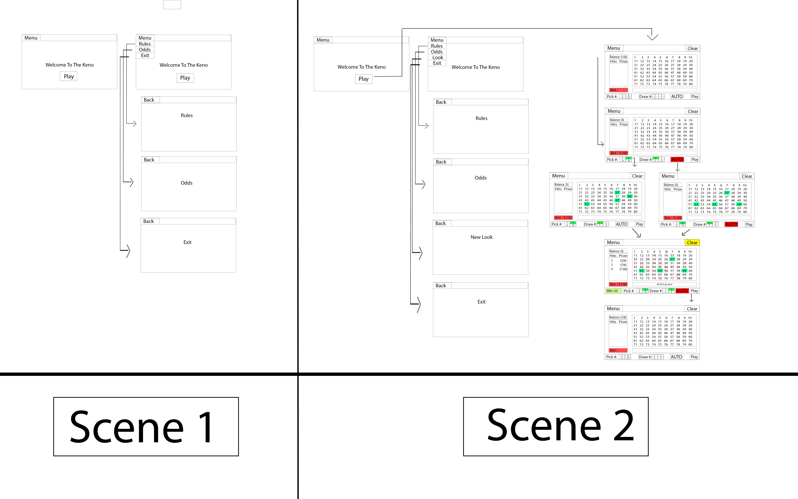

# Keno Game

This is an implementation of the popular casino and state lottery game, Keno, developed in Java using JavaFX for the GUI and Maven for the project management.

## How to Play

Players wager by choosing a set amount of numbers ranging from 1 to 80. After all players have made their wagers and picked their numbers, twenty numbers are drawn at random, between 1 and 80 with no duplicates. Players win by matching a set amount of their numbers to the numbers that are randomly drawn.

In this implementation, a single player can play the game by filling out a bet card with the number of spots they have chosen to play, selecting how many drawings they want to play the bet card for, and optionally letting the game pick their numbers for them. After each drawing, the player will be informed of how many numbers they matched, what those numbers were, and how much they have won on that drawing. They will also be notified of the total they have won since they started the program. After the selected amount of drawings have completed, the player will be able to fill out a new bet card, spots to play and drawings to play, or exit the program.

## Installation and Usage

1. Clone the repository: `git clone https://github.com/yourusername/keno-game.git`
2. Open the project in your preferred IDE (Eclipse, IntelliJ, etc.)
3. Build the project using Maven: `mvn clean package`
4. Run the project: `java -jar target/keno-game-1.0-SNAPSHOT-jar-with-dependencies.jar`

## Dependencies

This project requires the following dependencies:

- Java 8 or higher
- JavaFX 8 or higher
- Maven 3 or higher

## Class Diagram

[Keno Game Class Diagram Descriptions](./UML.MD)

## Object Diagram

[Keno Game Object Diagram](./UML.MD)

## Interaction Diagrams

<!-- ### Keno Game Initialization
 -->
### Keno Game Drawing

## Testing

This project includes JUnit 5 test cases to test the logic of the game. These can be run using the following command: `mvn test`

## Credits

This project was created by Seyfal Sultanov and Name2 for the CS 342 course at University of Illinois at Chicago. 
