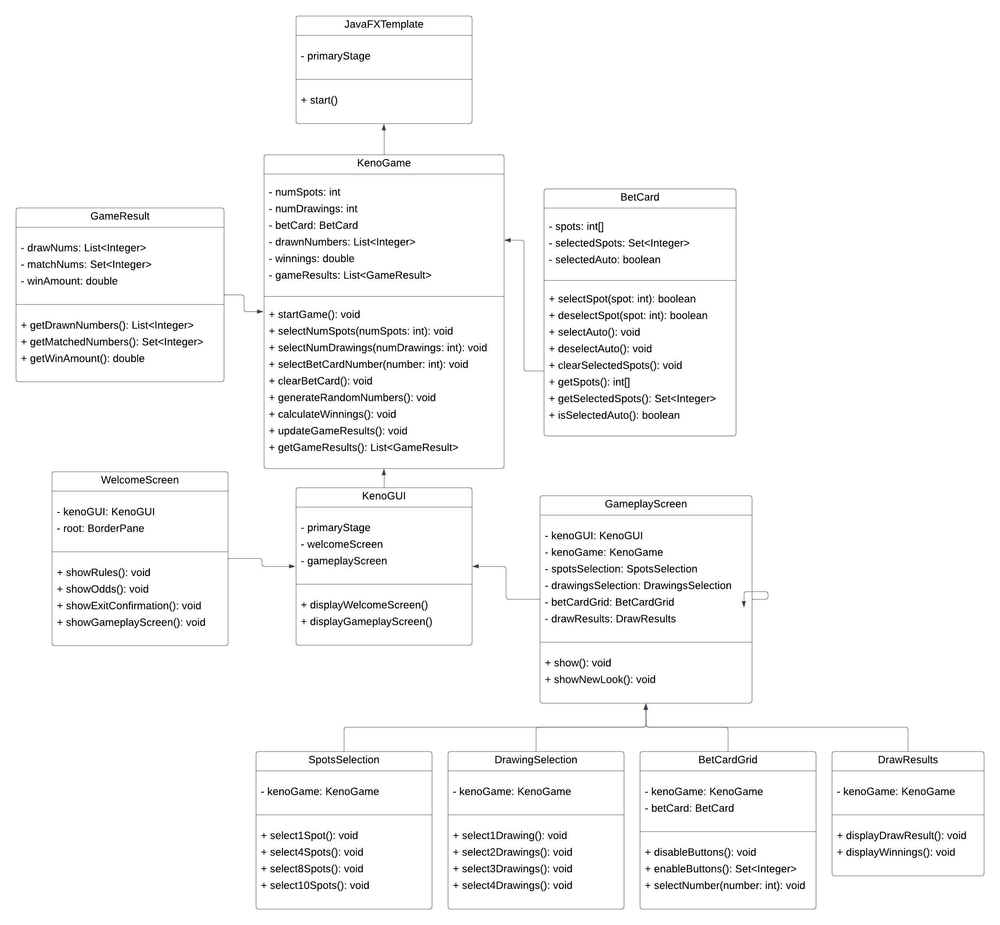

# UML Class Diagram Explanation

The UML diagram consists of three classes: `KenoGame`, `BetCard`, and `GameResult`. Each of these classes has its own set of attributes and methods that are used to implement the game.

Starting with the `KenoGame` class, this class represents the overall game and contains the following attributes:

- `numSpots`: an integer representing the number of spots the player has chosen to play.
- `numDrawings`: an integer representing the number of drawings the player has chosen to play.
- `betCard`: an instance of the `BetCard` class representing the player's bet card.
- `drawnNumbers`: a list of integers representing the numbers that have been randomly drawn in each drawing.
- `winnings`: a double representing the total amount that the player has won since starting the game.
- `gameResults`: a list of instances of the `GameResult` class representing the results of each drawing.

The `KenoGame` class also has several methods that are used to play the game, including:

- `startGame()`: a method that starts the game and initializes the necessary variables.
- `selectNumSpots(numSpots: int)`: a method that allows the player to select the number of spots they want to play.
- `selectNumDrawings(numDrawings: int)`: a method that allows the player to select the number of drawings they want to play.
- `selectBetCardNumber(number: int)`: a method that allows the player to select a number on their bet card.
- `clearBetCard()`: a method that clears the player's bet card.
- `generateRandomNumbers()`: a method that generates the random numbers for each drawing.
- `calculateWinnings()`: a method that calculates the player's winnings for each drawing.
- `updateGameResults()`: a method that updates the list of game results.
- `getGameResults()`: a method that returns the list of game results.

Moving on to the `BetCard` class, this class represents the player's bet card and contains the following attributes:

- `spots`: an array of integers representing the spots on the bet card.
- `selectedSpots`: a set of integers representing the spots that the player has selected.
- `selectedAuto`: a boolean representing whether the player has chosen to have their numbers selected automatically.

The `BetCard` class also has several methods that are used to interact with the bet card, including:

- `selectSpot(spot: int)`: a method that allows the player to select a spot on the bet card.
- `deselectSpot(spot: int)`: a method that allows the player to deselect a spot on the bet card.
- `selectAuto()`: a method that allows the player to select automatic number selection.
- `deselectAuto()`: a method that allows the player to deselect automatic number selection.
- `clearSelectedSpots()`: a method that clears the player's selected spots.
- `getSpots()`: a method that returns the array of spots on the bet card.
- `getSelectedSpots()`: a method that returns the set of selected spots on the bet card.
- `isSelectedAuto()`: a method that returns a boolean indicating whether the player has selected automatic number selection.

The `GameResult` class represents the result of a single drawing and contains the following attributes:

- `drawNums`: a list of integers representing the numbers that were drawn.
- `matchNums`: a set of integers representing the numbers that matched the player's selected spots.
- `winAmount`: a double representing the amount that the player won in the drawing.
<!-- 
#GUI Classes 

## KenoGUI

### Attributes

- `stage: Stage`: The JavaFX Stage on which the GUI is displayed.
- `root: Parent`: The root node of the scene graph for the GUI.
- `scene: Scene`: The scene containing the root node for the GUI.
- `currentScreen: Parent`: The currently displayed screen of the GUI.
- `welcomeScreen: WelcomeScreen`: The welcome screen of the GUI.
- `gameplayScreen: GameplayScreen`: The gameplay screen of the GUI.

### Methods

- `init()`: Initializes the GUI by creating the stage, setting the title, and showing the welcome screen.
- `setScreen(screen: Parent)`: Sets the currently displayed screen of the GUI.
- `switchToWelcomeScreen()`: Switches the currently displayed screen to the welcome screen.
- `switchToGameplayScreen()`: Switches the currently displayed screen to the gameplay screen.
## WelcomeScreen

### Attributes

- `root: Parent`: The root node of the scene graph for the welcome screen.
- `gui: KenoGUI`: The KenoGUI instance to which the welcome screen belongs.
- `playButton: Button`: The button for starting the game.

### Methods

- `init()`: Initializes the welcome screen by creating the scene graph and setting up the play button.
- `onPlayButtonClicked(event: ActionEvent)`: Event handler for when the play button is clicked. Switches to the gameplay screen.
## GameplayScreen

### Attributes

- `root: Parent`: The root node of the scene graph for the gameplay screen.
- `gui: KenoGUI`: The KenoGUI instance to which the gameplay screen belongs.
- `spotsSelection: SpotsSelection`: The spots selection component of the gameplay screen.
- `drawingsSelection: DrawingsSelection`: The drawings selection component of the gameplay screen.
- `betCardGrid: BetCardGrid`: The bet card grid component of the gameplay screen.
- `drawResults: DrawResults`: The draw results component of the gameplay screen.

### Methods

- `init()`: Initializes the gameplay screen by creating the scene graph and setting up its components.
- `updateDrawResults(results: List<Int>)`: Updates the draw results component with the given list of numbers.

## WelcomeScreen

### Attributes

- `root: Parent`: The root node of the scene graph for the welcome screen.
- `gui: KenoGUI`: The KenoGUI instance to which the welcome screen belongs.
- `playButton: Button`: The button for starting the game.

### Methods

- `init()`: Initializes the welcome screen by creating the scene graph and setting up the play button.
- `onPlayButtonClicked(event: ActionEvent)`: Event handler for when the play button is clicked. Switches to the gameplay screen.
## DrawingsSelection

### Attributes

- `root: Parent`: The root node of the scene graph for the drawings selection screen.
- `gui: KenoGUI`: The KenoGUI instance to which the drawings selection screen belongs.
- `drawings: List<CheckBox>`: The list of checkboxes representing the available drawings.

### Methods

- `init()`: Initializes the drawings selection screen by creating the scene graph and setting up the checkboxes.
- `getSelectedDrawings(): List<Integer>`: Returns a list of the IDs of the selected drawings.
## BetCardGrid

### Attributes

- `root: Parent`: The root node of the scene graph for the bet card grid.
- `gui: KenoGUI`: The KenoGUI instance to which the bet card grid belongs.
- `betCard: BetCard`: The BetCard instance represented by the grid.
- `cells: List<List<BetCell>>`: The 2D list of BetCell instances representing the grid.

### Methods

- `init()`: Initializes the bet card grid by creating the scene graph and setting up the cells.
- `getCell(row: Int, col: Int): BetCell`: Returns the BetCell instance at the specified row and column.
- `update(): Unit`: Updates the scene graph to reflect changes in the bet card.
## DrawResults

### Attributes

- `root: Parent`: The root node of the scene graph for the draw results screen.
- `gui: KenoGUI`: The KenoGUI instance to which the draw results screen belongs.
- `drawings: List<Int>`: The list of integers representing the numbers drawn.
- `labels: List<Label>`: The list of labels representing the drawn numbers.

### Methods

- `init()`: Initializes the draw results screen by creating the scene graph and setting up the labels.
- `update(drawings: List<Int>): Unit`: Updates the scene graph to reflect the new set of drawn numbers.
## JavaFXTemplate

### Attributes

- `stage: Stage`: The primary stage of the JavaFX application.
- `root: Parent`: The root node of the scene graph for the JavaFX scene.
- `scene: Scene`: The scene for the JavaFX stage.

### Methods

- `init()`: Initializes the JavaFX application by creating the scene graph and setting up the stage.
- `setScene(newScene: Scene): Unit`: Sets the scene for the JavaFX stage to the specified scene.
- `show()`: Shows the JavaFX stage.
 -->

- `init()`: Initializes the spots selection component by creating the scene graph and setting up the spot buttons.
- `onSpotButtonClicked(event: ActionEvent)`: Event handler for when a spot button is clicked. Adds or removes the clicked spot from the selected spots list.
- `getSelectedSpots()`: Returns the list of currently selected spots.
